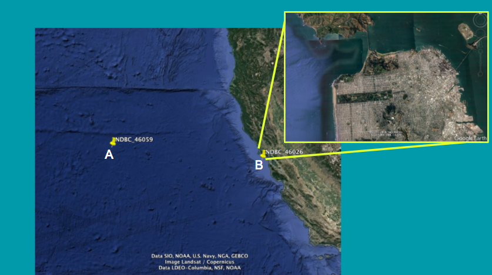
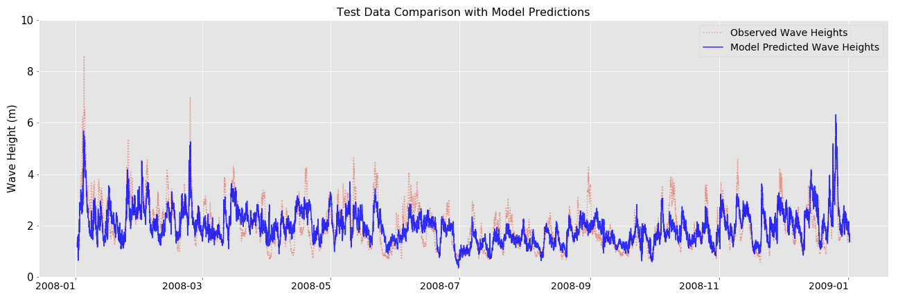

## NEARSHORE WAVE HEIGHT PREDICTION WITH MACHINE LEARNING

### MOTIVATION
The motivation for this project comes from my passion for surfing. Living in Hawaii for about seven years, I really got into surfing. As surfers we are always looking for the next good time to go surf. As such we check the surf forecast from websites such as magicseaweed, surfline etc... These professinal surf forecasting websites use complicated and complex hydrodynamic numerical models which requires extensive and indepth domina knowledge for implementation. My goal for this project is to explore machine learning as an alternative to these complex hydrodynamic models, to predict near shore wave heights using offshore buoy wave data. As such I went looking for data ...

### DATA
The main source of data for this project is National Data Buoy Center(NDBC) of US National Oceanic and Atmospheric Administration ([NOAA](http://www.ndbc.noaa.gov/)), which provides offshore wave data measurements for specific locations in the Pacific and Atlantic Ocean. NOAA keeps historic data for many buoy locations along the pacific ocean, together with real time data that comes in about every 15-20 minutes.

I used the NDBC API and gathared wave data from a number of buoys along the California coast and offshore in the Pacific Ocean.In order to get an idea of which buoys have the most complete data sets with minimal missing data I created a heat map whcih shows the percentage of missing data for each buoy. The figure below shows the heat map. Vertical axis shows the buoys and the horizontal axis shows some of the predictors that will be used to train/test the model. 

The figure above helped me in pin pointing a couple of buoys with which to move forward with the project. To this end, I chose Buoy 46059(A) and Buoy 46026(B). Figure below shows the location of these two buoys. Both are located off the coast of San Francisco shoreline.  Buoy A is located about 650 km off the coastline and buoy B is located close to Ocean Beach, a famous surf beach located along the  San Francisco shoreline. Figure below shows the location of the Beach. 

### DATA CLEANING AND PREPARING FOR TRAINING

The training and testing data was generated based on the meteorological conditions observed at buoy A, the offshore buoy. 
The predictor labels to pair with the training/testing data was generated by taking into account the speed of the observed wave at the offshore location. This gives an estimate of the travel time from buoy A to buoy B. Based on this travel time, wave heights seen at buoy B, could be paired with the predictors from buoy A, to generated the full set of predictors and labels. Figure below shows an example of travel time, for a wave to travel from offshore (A) to onshore location (B). The goal is to teach the model, given a set of predictors at buoy A(offshore location) what will be the predicted wave height at buoy B(close to Ocean Beach).

### MODELING AND RESULTS

After the data cleaning, 11 years of data was selected for traning and testing purposes. 10 years of this data was used for training and 1 year was held out for testing. The training data was fit to a Grandient Boosted Regressor model. Figure below shows the test data comparison with the model predictions.

The above figure, shows that the model had learned to pick up on the wave height predictions at the onshore location(Ocean Beach), based on offshore buoy data, to a certain degree of accuracy. The root mean square error for the model is 0.3 m. The wave heights in the data range from ~ 1 m to ~ 8 m with a mean of ~ 3 m.

